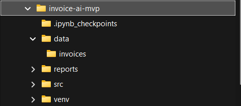
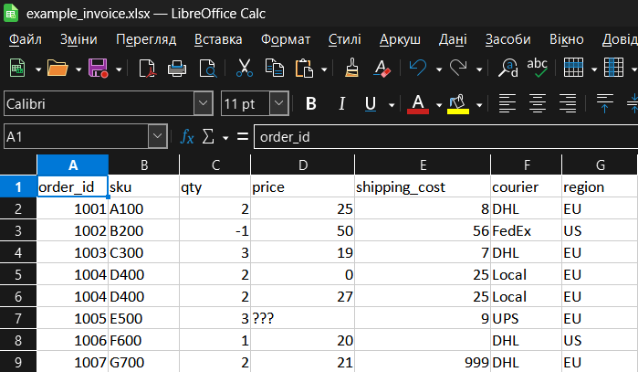
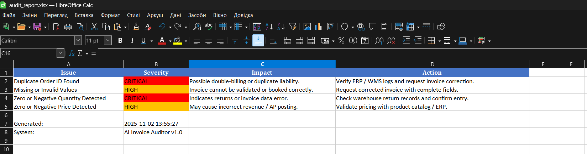
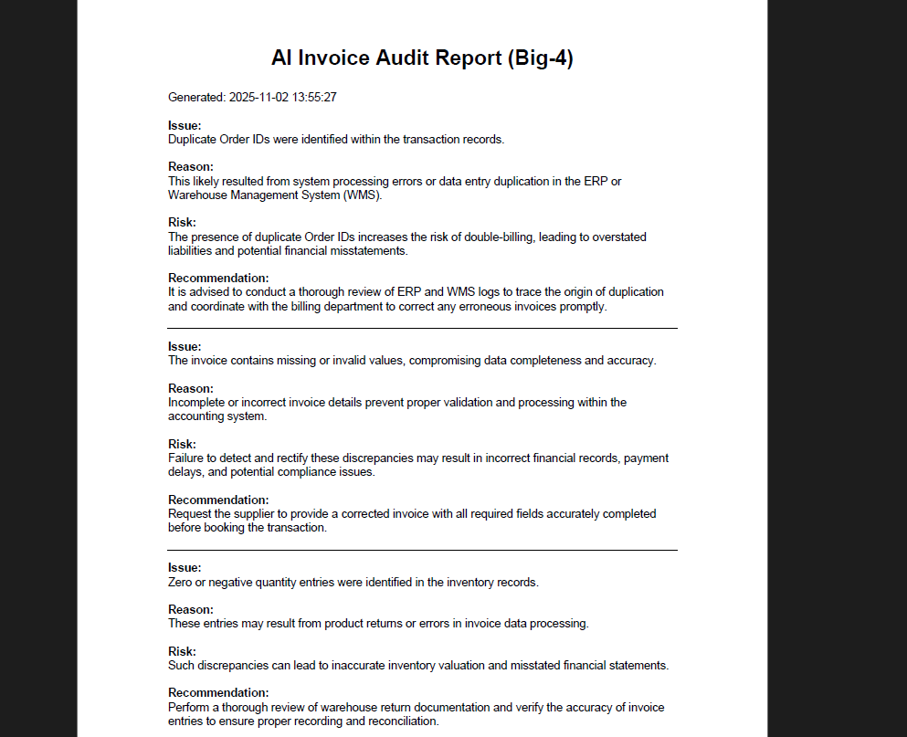
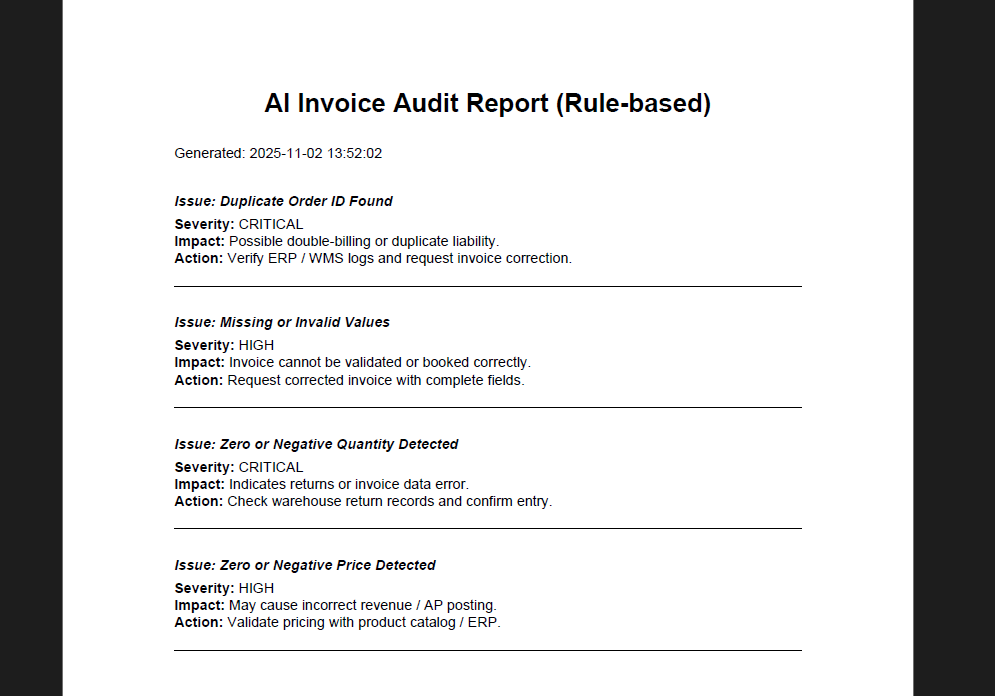
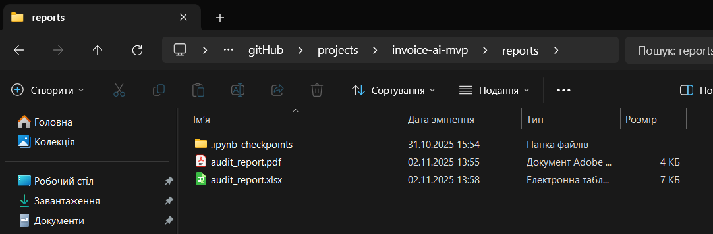

# ✅ AI-Powered Invoice Auditor (Rule-Based + Big-4 AI)


Smart invoice audit tool that validates vendor invoices, detects anomalies, and generates financial audit notes in **Big-4 auditor style** (Deloitte/EY/PwC/KPMG).

Built for e-commerce & logistics workflows with thousands of orders — automates validation, compliance checks, and reporting.

> AI mode uses **OpenAI gpt-4.1-mini**.  
> If no API key — system gracefully falls back to rule-based logic.

## 🎥 Live Demo (YouTube)

▶️ [Watch Demo on YouTube](https://youtu.be/cE7hPfBeiQs)

---

## 📸 Screenshots

### Project Structure


### Rule-based CLI Mode


### AI Audit CLI Mode


### Invoice Input Example


### Excel Output


### AI Big4 PDF Output


### Rule-based PDF Output


### Reports Folder



## 🚀 Features

### ✅ Core capabilities
| Feature | Description |
|---|---|
Invoice validator | Detects data errors & risk cases  
Rule-based audit | deterministic validation logic  
AI audit mode | Big-4 style reasoning & recommendations  
Duplicate detection | Avoid double-billing  
Negative/zero values | Qty, price, shipping cost checks  
Anomaly detection | > statistical deviation shipping cost  
Excel report | Summary export for accounting  
PDF audit report | Finance-ready audit output  
CLI tool | One-command processing  
Fallback logic | Works without API key  

---

## 🧠 AI Mode (Big-4 Auditor)

Produces audit notes like:

```
Issue:
Duplicate Order IDs were identified within the transaction records.

Reason:
This likely stems from system processing errors or inadequate validation controls in the ERP or WMS systems.

Risk:
The presence of duplicate Order IDs increases the risk of double-billing, resulting in financial misstatements and potential overpayment liabilities.

Recommendation:
It is advised to conduct a thorough review of ERP and WMS transaction logs to identify the root cause, followed by requesting invoice corrections to eliminate duplicate charges and strengthen system controls to prevent recurrence.
```

Model used: **OpenAI `gpt-4.1-mini`**

---

## 🏗 Project Structure

```
invoice-ai-mvp/
 ├─ src/
 │   ├─ cli.py                  # CLI entrypoint
 │   ├─ parse_invoice.py        # Parsing & rules
 │   ├─ validation.py           # Business validation logic
 │   ├─ ai_auditor.py           # Severity mapping rules
 │   ├─ ai_big4_audit.py        # Big-4 audit reasoning
 │   ├─ exel_report.py          # Excel export
 │   ├─ pdf_report.py           # PDF export
 │   └─ export_report.py        # Combined export handler
 │
 ├─ data/
 │   └─ invoices/example_invoice.xlsx
 │
 ├─ reports/
 │   ├─ audit_report.xlsx
 │   └─ audit_report.pdf
 │
 ├─ requirements.txt
 └─ .env.example
```

> Note: script expects invoice in `data/invoices/`

---

## 🛠 Installation

```bash
git clone <repo-url>
cd invoice-ai-mvp
pip install -r requirements.txt
```

Create `.env` file (optional for AI mode):

```
OPENAI_API_KEY=your_key_here
```

---

## ▶️ Usage

### ✅ Rule-based mode (no AI required)
```bash
python src\cli.py --file example_invoice.xlsx --mode rule_based
```

### 🤖 AI mode (Big-4 audit reasoning)
```bash
python src\cli.py --file example_invoice.xlsx --mode ai
```

> If no API key found — automatically falls back to rule-based audit.

---

## 📂 Output Reports

Generated to `reports/`:

- `audit_report.xlsx` — structured issue list
- `audit_report.pdf` — finance-ready audit sheet

---

## 📊 Example Checks

| Check | Example detection |
|---|---|
Duplicate order ID | Prevent double-billing  
Missing values | Vendor invoice errors  
Negative qty or price | Returns / data entry issue  
Shipping cost outliers | 3PL billing anomalies  
AI-reasoned notes | Executive audit commentary  

---

## 🎯 Business Value

Designed for:

| Use Case | Benefit |
|---|---|
E-commerce | Validate 3PL / supplier invoices  
Finance teams | Automated audit workflows  
CFO / Controllers | Reduce AP errors & fraud exposure  
Upwork clients | Fast invoice QA tool for stores & warehouses  

Reduces **financial risk & manual audit time by 5-10x**.

---

## 🧩 Roadmap

- ✅ MVP (rule-based + AI audit)
- ⬜ Web dashboard
- ⬜ Multi-file batch audit
- ⬜ 3PL + Shopify API integration
- ⬜ Export to Google Sheets

---

## 🙋 About This Project

This project was developed as a **real-world invoice automation MVP** inspired by e-commerce finance operations.

Architecture designed for easy extension — new checks can be added in `validation.py`.

---

## 💡 Want to Extend?

Add more rules:

- fraud scoring
- multi-currency support
- API billing vs WMS reconciliation
- OCR invoice reader
- anomaly detection model

---

## 🧪 Sample Test File

```
data/invoices/example_invoice.xlsx
```

---

## 📬 Contact

Open to freelance collaboration on:

- Data automation
- E-commerce finance tools
- Python audit pipelines
- AI business automation

---
